# Meet2Obsidian: Project Structure

This file visualizes the current structure of the Meet2Obsidian project. This diagram will be updated as the project evolves.

## ASCII Directory Tree

```
meet2obsidian/
├── CLAUDE.md
├── LICENSE
├── PROJECT_STRUCTURE.md
├── README.md
├── create-docs-dirs.sh
├── docs/
│   ├── README.md
│   ├── api/
│   │   ├── README.md
│   │   ├── claude.md
│   │   └── revai.md
│   ├── assets/
│   │   └── templates/
│   │       ├── api-template.md
│   │       └── component-template.md
│   ├── dev/
│   │   ├── README.md
│   │   └── components/
│   │       └── API Key Management.md
│   ├── development.md
│   ├── examples/
│   │   ├── config-examples/
│   │   │   └── basic-config.yaml
│   │   └── template-examples/
│   │       └── default.md.j2
│   ├── index.md
│   ├── internal_docs/
│   │   ├── INTRODUCTION.md
│   │   ├── Kanban meet2obsidian dev.md
│   │   ├── Архитектура системы.md
│   │   ├── Дорожная карта.md
│   │   ├── Технический стек.md
│   │   └── Функциональные и нефункциональные требования.md
│   ├── usage.md
│   └── user/
│       ├── README.md
│       └── getting-started/
│           └── installation.md
├── meet2obsidian/
│   ├── __init__.py
│   ├── api/
│   │   ├── __init__.py
│   │   ├── claude.py
│   │   └── revai.py
│   ├── audio/
│   │   ├── __init__.py
│   │   └── extractor.py
│   ├── cache.py
│   ├── cli.py
│   ├── config.py
│   ├── core.py
│   ├── monitor.py
│   ├── note/
│   │   ├── __init__.py
│   │   ├── generator.py
│   │   └── obsidian.py
│   └── utils/
│       ├── __init__.py
│       ├── logging.py
│       ├── security.py
│       └── status.py
├── pyproject.toml
├── requirements.txt
├── scripts/
│   ├── check_videos.py
│   ├── install.sh
│   ├── setup_api_keys.py
│   └── setup_launchagent.sh
├── setup.py
├── tmp/
│   ├── config_implementation_fixes.md
│   └── logging_tests_documentation.md
└── tests/
    ├── __init__.py
    ├── integration/
    │   ├── __init__.py
    │   └── test_pipeline.py
    └── unit/
        ├── __init__.py
        ├── test_cli.py
        ├── test_config.py
        ├── test_core.py
        └── test_logging.py
```

## Mermaid Project Structure Diagram

```mermaid
graph TD
    Root["Meet2Obsidian"] --> Docs["docs/"]
    Root --> Meet2Obsidian["meet2obsidian/"]
    Root --> Scripts["scripts/"]
    Root --> Tests["tests/"]
    Root --> ConfigFiles["Configuration Files"]
    Root --> TmpFiles["tmp/"]

    %% Documentation structure
    Docs --> DocsREADME["README.md"]
    Docs --> DocsAPI["api/"]
    Docs --> DocsAssets["assets/"]
    Docs --> DocsDev["dev/"]
    Docs --> DocsExamples["examples/"]
    Docs --> DocsInternal["internal_docs/"]
    Docs --> DocsUser["user/"]
    Docs --> DocsIndex["index.md"]
    Docs --> DocsUsage["usage.md"]
    Docs --> DocsDevelopment["development.md"]

    %% API docs
    DocsAPI --> DocsAPIReadme["README.md"]
    DocsAPI --> DocsAPIClaude["claude.md"]
    DocsAPI --> DocsAPIRevai["revai.md"]

    %% Assets
    DocsAssets --> DocsAssetsTemplates["templates/"]
    DocsAssetsTemplates --> DocsAssetsTemplatesAPI["api-template.md"]
    DocsAssetsTemplates --> DocsAssetsTemplatesComponent["component-template.md"]

    %% Dev docs
    DocsDev --> DocsDevReadme["README.md"]
    DocsDev --> DocsDevComponents["components/"]
    DocsDevComponents --> DocsDevComponentsAPIKey["API Key Management.md"]

    %% Examples
    DocsExamples --> DocsExamplesConfig["config-examples/"]
    DocsExamplesConfig --> DocsExamplesConfigBasic["basic-config.yaml"]
    DocsExamples --> DocsExamplesTemplates["template-examples/"]
    DocsExamplesTemplates --> DocsExamplesTemplatesDefault["default.md.j2"]

    %% Internal docs
    DocsInternal --> DocsInternalIntro["INTRODUCTION.md"]
    DocsInternal --> DocsInternalKanban["Kanban meet2obsidian dev.md"]
    DocsInternal --> DocsInternalArch["Архитектура системы.md"]
    DocsInternal --> DocsInternalRoadmap["Дорожная карта.md"]
    DocsInternal --> DocsInternalTechStack["Технический стек.md"]
    DocsInternal --> DocsInternalRequirements["Функциональные и нефункциональные требования.md"]

    %% User docs
    DocsUser --> DocsUserReadme["README.md"]
    DocsUser --> DocsUserGettingStarted["getting-started/"]
    DocsUserGettingStarted --> DocsUserGettingStartedInstall["installation.md"]

    %% Main Python package structure
    Meet2Obsidian --> Meet2ObsidianInit["__init__.py"]
    Meet2Obsidian --> Meet2ObsidianAPI["api/"]
    Meet2Obsidian --> Meet2ObsidianAudio["audio/"]
    Meet2Obsidian --> Meet2ObsidianNote["note/"]
    Meet2Obsidian --> Meet2ObsidianUtils["utils/"]
    Meet2Obsidian --> Meet2ObsidianCLI["cli.py"]
    Meet2Obsidian --> Meet2ObsidianConfig["config.py"]
    Meet2Obsidian --> Meet2ObsidianCore["core.py"]
    Meet2Obsidian --> Meet2ObsidianMonitor["monitor.py"]
    Meet2Obsidian --> Meet2ObsidianCache["cache.py"]

    %% API Package
    Meet2ObsidianAPI --> Meet2ObsidianAPIInit["__init__.py"]
    Meet2ObsidianAPI --> Meet2ObsidianAPIClaude["claude.py"]
    Meet2ObsidianAPI --> Meet2ObsidianAPIRevai["revai.py"]

    %% Audio Package
    Meet2ObsidianAudio --> Meet2ObsidianAudioInit["__init__.py"]
    Meet2ObsidianAudio --> Meet2ObsidianAudioExtractor["extractor.py"]

    %% Note Package
    Meet2ObsidianNote --> Meet2ObsidianNoteInit["__init__.py"]
    Meet2ObsidianNote --> Meet2ObsidianNoteGenerator["generator.py"]
    Meet2ObsidianNote --> Meet2ObsidianNoteObsidian["obsidian.py"]

    %% Utils Package
    Meet2ObsidianUtils --> Meet2ObsidianUtilsInit["__init__.py"]
    Meet2ObsidianUtils --> Meet2ObsidianUtilsLogging["logging.py"]
    Meet2ObsidianUtils --> Meet2ObsidianUtilsSecurity["security.py"]
    Meet2ObsidianUtils --> Meet2ObsidianUtilsStatus["status.py"]

    %% Scripts
    Scripts --> ScriptsCheckVideos["check_videos.py"]
    Scripts --> ScriptsInstall["install.sh"]
    Scripts --> ScriptsSetupApiKeys["setup_api_keys.py"]
    Scripts --> ScriptsSetupLaunchAgent["setup_launchagent.sh"]
    
    %% Tmp files
    TmpFiles --> TmpConfigFixes["config_implementation_fixes.md"]
    TmpFiles --> TmpLoggingDocs["logging_tests_documentation.md"]

    %% Tests
    Tests --> TestsInit["__init__.py"]
    Tests --> TestsIntegration["integration/"]
    Tests --> TestsUnit["unit/"]

    %% Integration Tests
    TestsIntegration --> TestsIntegrationInit["__init__.py"]
    TestsIntegration --> TestsIntegrationPipeline["test_pipeline.py"]

    %% Unit Tests
    TestsUnit --> TestsUnitInit["__init__.py"]
    TestsUnit --> TestsUnitCLI["test_cli.py"]
    TestsUnit --> TestsUnitConfig["test_config.py"]
    TestsUnit --> TestsUnitCore["test_core.py"]
    TestsUnit --> TestsUnitLogging["test_logging.py"]

    %% Configuration Files
    ConfigFiles --> ProjectToml["pyproject.toml"]
    ConfigFiles --> Requirements["requirements.txt"]
    ConfigFiles --> Setup["setup.py"]
    ConfigFiles --> License["LICENSE"]
    ConfigFiles --> Readme["README.md"]
    ConfigFiles --> ClaudeMD["CLAUDE.md"]
    ConfigFiles --> ProjectStructureMD["PROJECT_STRUCTURE.md"]

    %% Styling
    classDef code fill:#f9f9f9,stroke:#666,stroke-width:1px
    classDef doc fill:#e8f4ea,stroke:#666,stroke-width:1px
    classDef test fill:#f2e8ea,stroke:#666,stroke-width:1px
    classDef config fill:#e8eaf4,stroke:#666,stroke-width:1px
    classDef tmp fill:#fef9e6,stroke:#666,stroke-width:1px

    class Meet2Obsidian,Meet2ObsidianAPI,Meet2ObsidianAudio,Meet2ObsidianNote,Meet2ObsidianUtils code
    class Docs,DocsAPI,DocsAssets,DocsDev,DocsExamples,DocsInternal,DocsUser doc
    class Tests,TestsIntegration,TestsUnit test
    class ConfigFiles,ProjectToml,Requirements,Setup,License,Readme,ClaudeMD,ProjectStructureMD config
    class TmpFiles,TmpConfigFixes,TmpLoggingDocs tmp
```



## Implementation Status

The project is in active development. Current status:

- **Core implementation**: 
  - Configuration module (`config.py`) implementation completed ✅
  - Basic structure is set up for other modules
  - Utils module partially implemented

- **Documentation**: 
  - Comprehensive documentation files exist, detailing the planned architecture and requirements
  - Internal developer docs available in `docs/internal_docs/`
  - API documentation in progress

- **Tests**: 
  - Unit tests for configuration module complete and passing ✅
  - Unit tests for logging module created (Epic 7) ✅
  - Test-driven development approach being followed

Key functional components:

- `utils/security.py`: KeychainManager for securely storing API keys in macOS Keychain ✅
- `config.py`: Configuration management system with JSON support and validation ✅
- `utils/logging.py`: Stub for structured logging system (awaiting implementation) 🔄
- `scripts/setup_api_keys.py`: Script for setting up and testing API keys ✅

### Completed Epics:
- **Epic 6**: Configuration module implementation ✅ (2025-05-12)
- **Epic 7 Task 1**: Tests for logging module configuration ✅ (2025-05-12)

### In Progress:
- **Epic 7**: Tests for the logging module 🔄
  - ✅ Task 1: Tests for logging configuration
  - 🔄 Task 2: Tests for logging levels
  - 🔄 Task 3: Tests for log rotation
  - 🔄 Task 4: Tests for structured logging

Last Updated: 2025-05-12