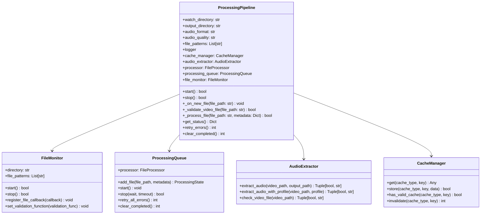

# Processing Pipeline Architecture

## Overview

The Processing Pipeline is a central component of meet2obsidian that coordinates the detection, processing, and audio extraction of video files. It integrates several core components:

- **FileMonitor**: Detects new video files in a watched directory
- **ProcessingQueue**: Manages the queue of files to be processed
- **AudioExtractor**: Extracts audio from video files
- **CacheManager**: Caches results to avoid redundant processing

The pipeline provides a cohesive system with centralized logging, error handling, and state management.

## Class Structure



## Operation Flow

The operation flow of the ProcessingPipeline is as follows:

1. **Initialization**:
   - Create instances of all components (FileMonitor, ProcessingQueue, AudioExtractor, CacheManager)
   - Configure each component with appropriate settings
   - Set up callbacks and integration points

2. **Start Sequence**:
   - Start the ProcessingQueue to prepare for file processing
   - Start the FileMonitor to begin watching for new files
   - The pipeline is now active and ready to process files

3. **File Processing Flow**:
   - FileMonitor detects a new video file in the watch directory
   - FileMonitor calls the validation function to ensure the file is valid
   - If valid, FileMonitor calls the callback function with the file path
   - The callback adds the file to the ProcessingQueue
   - ProcessingQueue processes the file using the provided processor function
   - The processor function extracts audio using AudioExtractor
   - Results are cached in CacheManager to avoid redundant processing

4. **Stop Sequence**:
   - Stop the FileMonitor to prevent detecting new files
   - Stop the ProcessingQueue to gracefully finish processing existing files

## Integration with ApplicationManager

The ProcessingPipeline is integrated with the ApplicationManager, which provides:

- Lifecycle management (start/stop)
- Configuration management
- Status reporting
- Signal handling

## Logging System

The ProcessingPipeline implements a centralized logging system:

- Each component receives a contextualized logger
- Logs include component identification
- All logs are directed to a central log file
- Log rotation is configured for managing log file sizes

## Error Handling

The pipeline implements robust error handling:

1. **Validation Failures**: Files that fail validation are skipped
2. **Processing Errors**: Errors during processing are caught and logged
3. **Retry Mechanism**: Failed files can be retried automatically
4. **State Persistence**: Processing state is persisted for recovery

## Cache Integration

The pipeline integrates with the CacheManager to:

- Cache extracted audio files
- Avoid redundant processing of the same files
- Track processed files for recovery

## Configuration Options

The ProcessingPipeline can be configured with various options:

```yaml
# Processing pipeline configuration
processing:
  file_patterns: ["*.mp4", "*.mov", "*.webm", "*.mkv"]
  min_file_age_seconds: 5
  max_concurrent_files: 3

audio:
  format: "m4a"
  quality: "medium"
```

## Thread Safety

The ProcessingPipeline is designed to be thread-safe:

- Each component implements proper locking
- State is protected by thread-safe access mechanisms
- Concurrent processing is managed with thread pools

## Status Reporting

The pipeline provides detailed status information:

- Files detected and processed
- Queue statistics
- Error counts
- Cache hits

## Usage Example

```python
# Create and configure the pipeline
pipeline = ProcessingPipeline(
    watch_directory="/path/to/videos",
    output_directory="/path/to/audio",
    cache_directory="/path/to/cache",
    audio_format="m4a",
    audio_quality="medium",
    file_patterns=["*.mp4", "*.mov"],
    max_concurrent=3,
    min_file_age_seconds=5,
    log_dir="/path/to/logs",
    log_level="info"
)

# Start the pipeline
pipeline.start()

# Get status information
status = pipeline.get_status()
print(f"Files processed: {status['stats']['files_processed']}")

# Retry any files that encountered errors
retry_count = pipeline.retry_errors()
print(f"Retried {retry_count} files")

# Stop the pipeline
pipeline.stop()
```