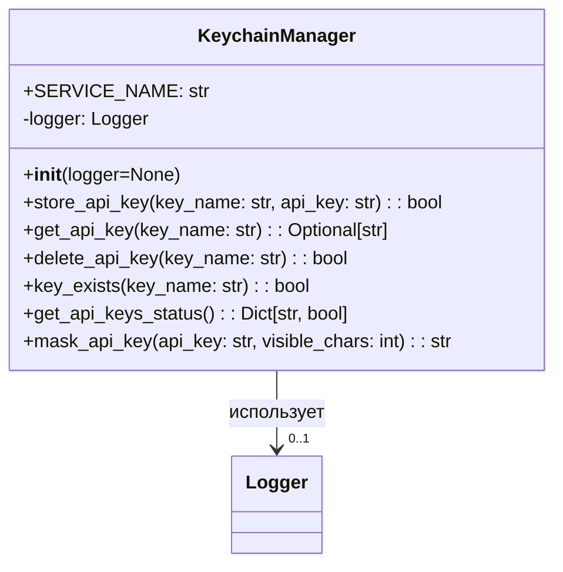
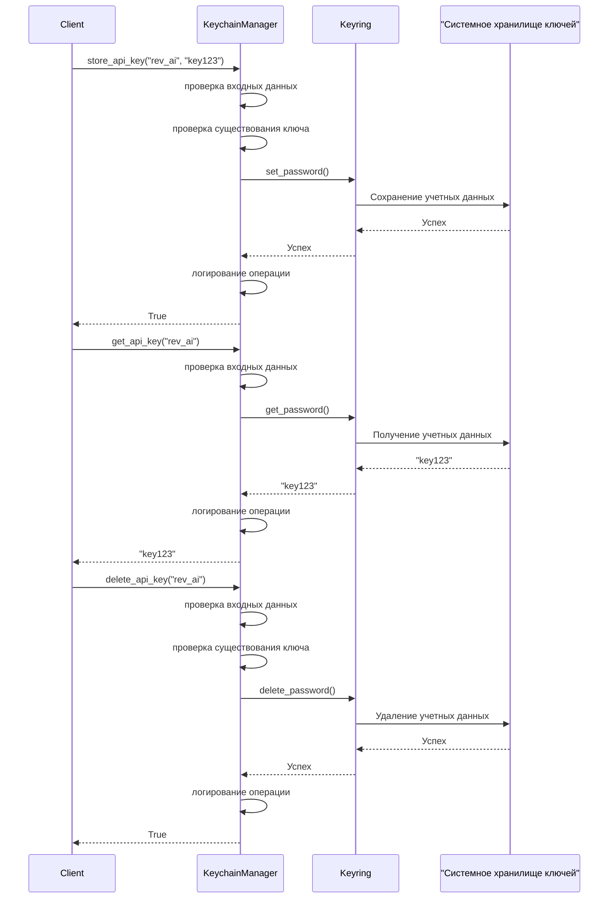

# Модуль управления API-ключами

## Обзор

Модуль управления API-ключами - это критически важный компонент безопасности в meet2obsidian, который обеспечивает безопасное хранение и управление API-ключами с использованием системного хранилища учетных данных (macOS Keychain). Этот компонент гарантирует, что чувствительные учетные данные API хранятся безопасно, предоставляя при этом простой интерфейс для доступа к этим учетным данным по мере необходимости.

## Архитектура

Модуль управления API-ключами реализован в виде класса `KeychainManager` в модуле `meet2obsidian.utils.security`. Он использует библиотеку Python `keyring` для взаимодействия с системным хранилищем учетных данных платформонезависимым способом.

### Диаграмма классов



### Диаграмма последовательности для операций с ключами



## Справочник по API

### Класс `KeychainManager`

Основной класс для управления API-ключами в системном хранилище ключей.

#### Конструктор

```python
def __init__(self, logger=None)
```

- **Параметры:**
  - `logger`: Опциональный экземпляр логгера. Если не предоставлен, будет создан новый логгер.

#### Методы

##### `store_api_key`

```python
def store_api_key(self, key_name: str, api_key: str) -> bool
```

Сохраняет API-ключ в хранилище.

- **Параметры:**
  - `key_name`: Имя ключа (например, 'rev_ai', 'claude')
  - `api_key`: Значение API-ключа для сохранения
- **Возвращает:**
  - `bool`: True в случае успеха, False в противном случае
- **Поведение:**
  - Отклоняет пустые имена ключей
  - Предупреждает о пустых значениях API-ключей
  - Логирует успех или неудачу
  - Обновляет существующие ключи, если они уже существуют

##### `get_api_key`

```python
def get_api_key(self, key_name: str) -> Optional[str]
```

Получает API-ключ из хранилища.

- **Параметры:**
  - `key_name`: Имя ключа для получения
- **Возвращает:**
  - `str` или `None`: API-ключ, если найден, в противном случае None
- **Поведение:**
  - Отклоняет пустые имена ключей
  - Возвращает None, если ключ не найден
  - Логирует успех или неудачу

##### `delete_api_key`

```python
def delete_api_key(self, key_name: str) -> bool
```

Удаляет API-ключ из хранилища.

- **Параметры:**
  - `key_name`: Имя ключа для удаления
- **Возвращает:**
  - `bool`: True в случае успеха, False в противном случае
- **Поведение:**
  - Отклоняет пустые имена ключей
  - Проверяет существование ключа перед попыткой удаления
  - Логирует успех или неудачу

##### `key_exists`

```python
def key_exists(self, key_name: str) -> bool
```

Проверяет, существует ли API-ключ в хранилище.

- **Параметры:**
  - `key_name`: Имя ключа для проверки
- **Возвращает:**
  - `bool`: True, если ключ существует, False в противном случае
- **Поведение:**
  - Отклоняет пустые имена ключей
  - Не логирует значения ключей

##### `get_api_keys_status`

```python
def get_api_keys_status(self) -> Dict[str, bool]
```

Получает статус необходимых API-ключей.

- **Возвращает:**
  - `Dict[str, bool]`: Словарь, сопоставляющий имена ключей со статусом существования
- **Поведение:**
  - Проверяет существование всех необходимых API-ключей (rev_ai, claude)
  - Возвращает словарь с информацией о статусе

##### `mask_api_key`

```python
def mask_api_key(self, api_key: str, visible_chars: int = 4) -> str
```

Маскирует API-ключ для безопасного отображения.

- **Параметры:**
  - `api_key`: API-ключ для маскирования
  - `visible_chars`: Количество символов, которые остаются видимыми в начале
- **Возвращает:**
  - `str`: Строка замаскированного API-ключа
- **Поведение:**
  - Показывает первые N символов, маскируя остальные звездочками
  - Корректно обрабатывает пустые ключи и короткие ключи

## Интеграция с другими компонентами

Модуль управления API-ключами интегрируется с несколькими другими компонентами:

1. **API-клиенты**: Клиенты Rev.ai и Claude API используют KeychainManager для получения API-ключей.
   ```python
   # Пример интеграции с API-клиентами
   from meet2obsidian.utils.security import KeychainManager
   
   class RevAiClient:
       def __init__(self, logger=None):
           self.keychain = KeychainManager(logger)
           self.api_key = self.keychain.get_api_key("rev_ai")
           # Использование api_key для вызовов API
   ```

2. **CLI-команды**: CLI-команды `apikeys` взаимодействуют с KeychainManager для операций CRUD.
   ```python
   # Пример интеграции с CLI
   from meet2obsidian.utils.security import KeychainManager
   
   @click.command()
   def list_keys():
       keychain = KeychainManager()
       statuses = keychain.get_api_keys_status()
       # Отображение статусов ключей
   ```

3. **Конфигурация**: Инициализация системы проверяет наличие необходимых API-ключей.
   ```python
   # Пример интеграции с инициализацией системы
   from meet2obsidian.utils.security import KeychainManager
   
   def initialize_system():
       keychain = KeychainManager()
       statuses = keychain.get_api_keys_status()
       if not all(statuses.values()):
           # Запрос недостающих ключей или предупреждение пользователя
   ```

## Соображения безопасности

1. **Безопасное хранение**: Все API-ключи хранятся в безопасном хранилище, предоставляемом ОС (macOS Keychain). Содержимое шифруется в состоянии покоя.

2. **Минимальное раскрытие**: Фактические значения API-ключей никогда не логируются и не отображаются полностью по умолчанию.

3. **Контроль доступа**: KeychainManager использует конкретное имя службы (`meet2obsidian`) для изоляции своих ключей от других приложений.

4. **Проверка входных данных**: Пустые имена ключей отклоняются для предотвращения определенных типов уязвимостей.

5. **Обработка ошибок**: Все ошибки перехватываются и правильно логируются, избегая утечки информации в сообщениях об ошибках.

## Примеры использования

### Базовое использование

```python
from meet2obsidian.utils.logging import setup_logging, get_logger
from meet2obsidian.utils.security import KeychainManager

# Настройка логирования
setup_logging(level="info")
logger = get_logger("my_component")

# Создание экземпляра KeychainManager
keychain = KeychainManager(logger=logger)

# Сохранение API-ключа
success = keychain.store_api_key("rev_ai", "my_api_key_value")

# Проверка существования ключа
if keychain.key_exists("rev_ai"):
    # Получение API-ключа
    api_key = keychain.get_api_key("rev_ai")
    if api_key:
        # Использование API-ключа
        print(f"Использование API-ключа: {keychain.mask_api_key(api_key)}")

# Удаление API-ключа, когда он больше не нужен
keychain.delete_api_key("test_key")
```

### Проверка необходимых ключей

```python
from meet2obsidian.utils.security import KeychainManager

def check_api_keys_configuration():
    """Проверка, настроены ли все необходимые API-ключи."""
    keychain = KeychainManager()
    status = keychain.get_api_keys_status()
    
    all_configured = all(status.values())
    
    if not all_configured:
        missing_keys = [key for key, exists in status.items() if not exists]
        print(f"Отсутствующие API-ключи: {', '.join(missing_keys)}")
        print("Пожалуйста, настройте эти ключи с помощью команды: meet2obsidian apikeys setup")
    
    return all_configured
```

## Тестирование

Компонент KeychainManager имеет исчерпывающие модульные тесты в `tests/unit/test_security.py` и интеграционные тесты в `tests/integration/test_security_integration.py`.

### Запуск модульных тестов

```shell
# Запуск всех тестов безопасности
pytest tests/unit/test_security.py

# Запуск конкретного теста
pytest tests/unit/test_security.py::TestKeychainManager::test_store_api_key_success
```

### Запуск интеграционных тестов

```shell
# Запуск интеграционных тестов (взаимодействует с реальным хранилищем ключей)
pytest -m integration tests/integration/test_security_integration.py
```

## CLI-команды для управления API-ключами

Модуль поставляется с CLI-командами для управления API-ключами:

```shell
# Установка API-ключа
meet2obsidian apikeys set rev_ai

# Получение API-ключа (маскируется по умолчанию)
meet2obsidian apikeys get rev_ai

# Получение API-ключа (отображение фактического значения)
meet2obsidian apikeys get rev_ai --show

# Вывод списка всех необходимых API-ключей и их статуса
meet2obsidian apikeys list

# Удаление API-ключа
meet2obsidian apikeys delete test_key

# Настройка всех необходимых API-ключей одновременно
meet2obsidian apikeys setup
```

## Зависимости

- `keyring`: Библиотека Python для доступа к системному хранилищу ключей
- `logging`: Стандартная библиотека для логирования операций
- `typing`: Стандартная библиотека для аннотаций типов

## Соображения по реализации

1. **Поддержка платформ**: Хотя разработан в первую очередь для macOS Keychain, использование библиотеки `keyring` гарантирует, что компонент может работать на других платформах, используя их собственные механизмы безопасного хранения.

2. **Восстановление после ошибок**: Компонент разработан для корректной обработки сбоев. Если ключ не может быть сохранен или получен, он возвращает четкий статус без сбоев.

3. **Логирование**: Все операции логируются с соответствующими уровнями (info для успешных операций, warning для потенциальных проблем, error для сбоев). Фактические значения ключей никогда не логируются.

4. **Производительность**: Операции оптимизированы для минимизации ненужных проверок и валидаций, обеспечивая быстрый доступ к ключам по мере необходимости.

5. **Проверка существования перед удалением**: Реализация проверяет существование ключа перед попыткой его удаления, чтобы избежать ненужных исключений и обеспечить более информативные сообщения.