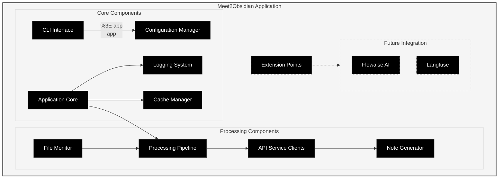
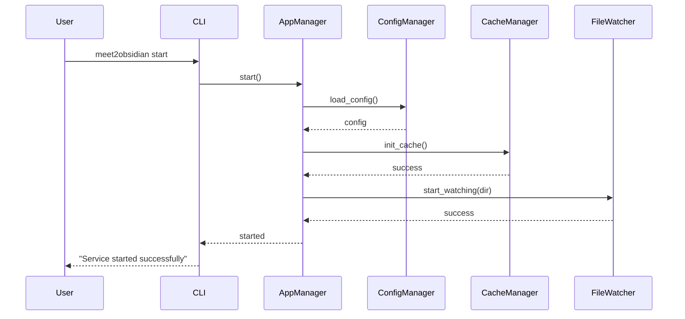
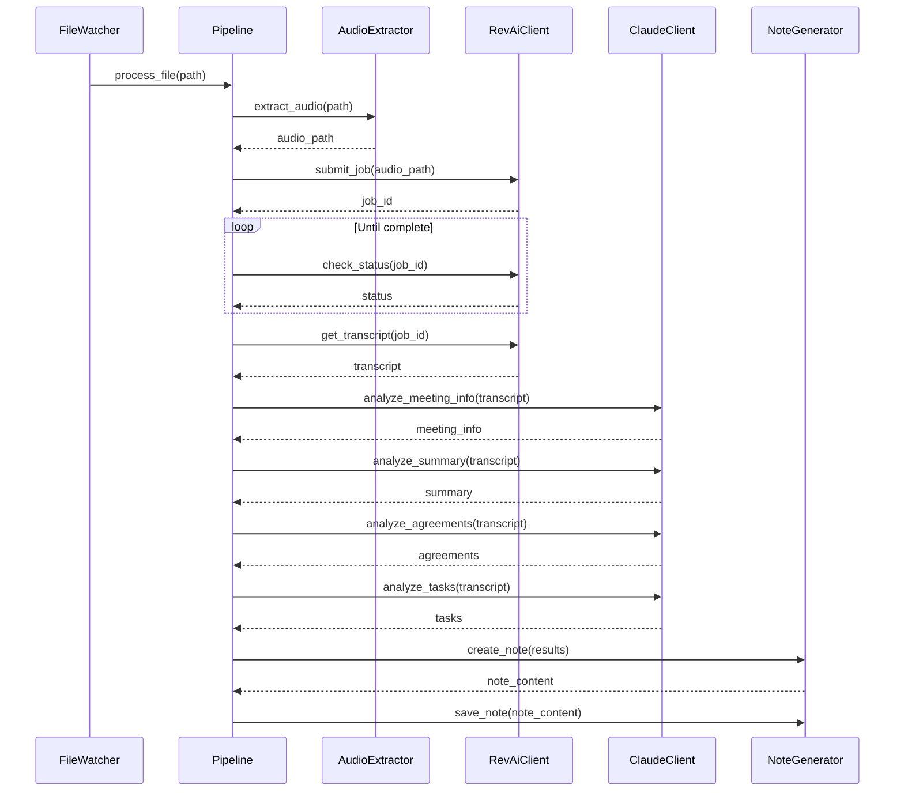
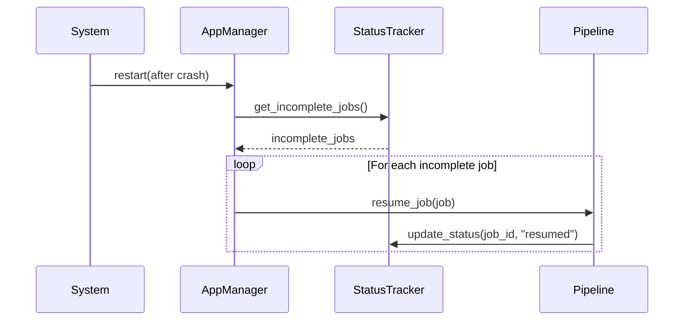

## 1. Общий обзор архитектуры

Meet2Obsidian реализуется как монолитное Python-приложение для macOS, работающее в фоновом режиме и управляемое через командную строку. Основная архитектура следует принципам модульности и последовательной обработки, с централизованным управлением процессами.

### 1.1 Архитектурная диаграмма высокого уровня



### 1.2 Компоненты системы

- **CLI Interface**: Предоставляет пользовательский интерфейс командной строки
- **Application Core**: Центральный компонент управления приложением
- **Configuration Manager**: Управляет конфигурацией и настройками
- **Logging System**: Обеспечивает логирование и мониторинг
- **Cache Manager**: Управляет локальным кэшированием данных и результатов
- **File Monitor**: Отслеживает новые файлы для обработки
- **Processing Pipeline**: Последовательная обработка файлов
- **API Service Clients**: Интеграция с Rev.ai и Claude API
- **Note Generator**: Создание заметок в Obsidian
- **Extension Points**: Абстракции для будущих интеграций

## 2. Детальное описание компонентов

### 2.1 CLI Interface

**Назначение**: Предоставляет интерфейс командной строки для управления приложением.

**Ключевые классы**:
- `CommandLineParser`: Парсинг аргументов командной строки
- `CommandExecutor`: Выполнение команд
- `StatusFormatter`: Форматирование вывода статуса и статистики

**Интерфейс**:
```python
class CLIInterface:
    def parse_args(self, args: List[str]) -> Dict:
        """Парсинг аргументов командной строки"""
        
    def execute_command(self, command: str, options: Dict) -> int:
        """Выполнение команды и возврат кода результата"""
        
    def format_status(self, status_data: Dict) -> str:
        """Форматирование данных статуса для вывода в терминал"""
        
    def format_logs(self, logs: List[Dict], level: str = "info") -> str:
        """Форматирование логов для вывода в терминал"""
```

**Поддерживаемые команды**:
- `start`: Запуск сервиса 
- `stop`: Остановка сервиса
- `status`: Получение статуса работы
- `logs`: Просмотр логов
- `config`: Управление конфигурацией
- `test`: Проверка зависимостей и соединений
- `help`: Вывод справки

### 2.2 Application Core

**Назначение**: Центральный компонент, управляющий жизненным циклом приложения и координирующий работу других компонентов.

**Ключевые классы**:
- `ApplicationManager`: Управление жизненным циклом приложения
- `ServiceRegistry`: Реестр сервисов и компонентов
- `HealthMonitor`: Мониторинг состояния системы
- `PipelineCoordinator`: Координация выполнения конвейера обработки

**Интерфейс**:
```python
class ApplicationManager:
    def start(self) -> bool:
        """Запуск приложения"""
        
    def stop(self) -> bool:
        """Остановка приложения"""
        
    def get_status(self) -> Dict:
        """Получение текущего статуса"""
        
    def register_termination_handler(self) -> None:
        """Регистрация обработчика сигналов завершения"""
        
    def install_launch_agent(self) -> bool:
        """Установка LaunchAgent для автозапуска"""
        
    def remove_launch_agent(self) -> bool:
        """Удаление LaunchAgent автозапуска"""
```

**Диаграмма состояний**:
```
┌─────────┐      start      ┌──────────┐
│         │───────────────▶ │          │
│   Idle  │                 │  Running │
│         │ ◀───────────────│          │
└─────────┘       stop      └──────────┘
     │                            │
     │           error            │
     ▼                            ▼
┌─────────┐                 ┌──────────┐
│         │                 │          │
│ Stopped │                 │  Error   │
│         │                 │          │
└─────────┘                 └──────────┘
```

### 2.3 Configuration Manager

**Назначение**: Управление пользовательскими настройками, конфигурацией и секретами.

**Ключевые классы**:
- `ConfigManager`: Управление конфигурационным файлом
- `KeychainManager`: Безопасное хранение секретов в macOS Keychain
- `PathResolver`: Управление путями к файлам и директориям
- `EnvManager`: Управление переменными окружения

**Интерфейс**:
```python
class ConfigManager:
    def load_config(self) -> Dict:
        """Загрузка конфигурации из файла"""
        
    def save_config(self, config: Dict) -> bool:
        """Сохранение конфигурации в файл"""
        
    def get_value(self, key: str, default: Any = None) -> Any:
        """Получение значения по ключу"""
        
    def set_value(self, key: str, value: Any) -> bool:
        """Установка значения по ключу"""
        
    def validate_config(self) -> List[str]:
        """Валидация конфигурации и возврат списка ошибок"""

class KeychainManager:
    def store_api_key(self, service: str, key: str) -> bool:
        """Сохранение API ключа в Keychain"""
        
    def get_api_key(self, service: str) -> Optional[str]:
        """Получение API ключа из Keychain"""
        
    def delete_api_key(self, service: str) -> bool:
        """Удаление API ключа из Keychain"""
```

**Структура конфигурационного файла**:
```yaml
# Пример полной конфигурации
paths:
  video_directory: "/Users/username/Documents/meet_records"
  obsidian_vault: "/Users/username/Documents/Obsidian/MainVault"
  
api:
  rev_ai:
    job_timeout: 3600
    max_retries: 3
  claude:
    model: "claude-3-opus-20240229"
    temperature: 0.1
    
processing:
  delete_video_files: true
  delete_audio_files: true
  max_video_duration: 14400  # 4 часа в секундах
  
templates:
  prompts:
    meeting_info: "prompts/meeting_info.txt"
    summary: "prompts/summary.txt"
    agreements: "prompts/agreements.txt"
    tasks: "prompts/tasks.txt"
  
system:
  autostart: true
  loglevel: "info"
  notifications: true
```

### 2.4 Logging System

**Назначение**: Обеспечение всесторонней системы логирования и мониторинга.

**Ключевые классы**:
- `LogManager`: Конфигурация и управление логированием
- `StatusTracker`: Отслеживание статуса обработки файлов
- `NotificationManager`: Отправка системных уведомлений
- `MetricsCollector`: Сбор метрик производительности

**Интерфейс**:
```python
class LogManager:
    def setup_logging(self, level: str = "info") -> None:
        """Настройка системы логирования"""
        
    def get_logger(self, name: str) -> logging.Logger:
        """Получение логгера для компонента"""
        
    def get_last_logs(self, level: str = "info", count: int = 50) -> List[Dict]:
        """Получение последних записей логов"""

class StatusTracker:
    def create_file_status(self, file_id: str, filename: str) -> Dict:
        """Создание записи статуса для файла"""
        
    def update_stage_status(self, file_id: str, stage: str, status: str, **details) -> None:
        """Обновление статуса этапа обработки"""
        
    def get_file_status(self, file_id: str) -> Dict:
        """Получение текущего статуса обработки файла"""
        
    def get_all_active_statuses(self) -> List[Dict]:
        """Получение статусов всех активных файлов"""
```

**Структура записи лога**:
```json
{
  "timestamp": "2025-05-09T14:23:45.342Z",
  "level": "INFO",
  "component": "file_monitor",
  "message": "Новый файл обнаружен для обработки",
  "details": {
    "filename": "meeting_2025-05-09.mp4",
    "size": 245788672,
    "path": "/Users/username/Documents/meet_records/meeting_2025-05-09.mp4"
  },
  "process_id": 12345
}
```

**Структура отслеживания статуса файла**:
```json
{
  "file_id": "20250509_142345_meeting",
  "original_filename": "meeting_2025-05-09.mp4",
  "start_time": "2025-05-09T14:23:45.342Z",
  "stages": [
    {"name": "detection", "status": "completed", "timestamp": "2025-05-09T14:23:45.342Z"},
    {"name": "audio_extraction", "status": "in_progress", "timestamp": "2025-05-09T14:25:12.125Z"},
    {"name": "video_cleanup", "status": "pending"},
    {"name": "transcription", "status": "pending"},
    {"name": "analysis", "status": "pending"},
    {"name": "note_creation", "status": "pending"},
    {"name": "cleanup", "status": "pending"}
  ],
  "errors": [],
  "metadata": {
    "file_size": 245788672,
    "estimated_duration": 1800
  }
}
```

### 2.5 File Monitor

**Назначение**: Мониторинг директории на появление новых видеофайлов и запуск процесса обработки.

**Ключевые классы**:
- `FileWatcher`: Отслеживание изменений в директории
- `FileValidator`: Проверка файлов на соответствие требованиям
- `FileQueue`: Очередь файлов для обработки
- `FileMetadataExtractor`: Извлечение метаданных из файлов

**Интерфейс**:
```python
class FileWatcher:
    def start_watching(self, directory: str) -> None:
        """Начало мониторинга директории"""
        
    def stop_watching(self) -> None:
        """Остановка мониторинга директории"""
        
    def on_file_created(self, file_path: str) -> None:
        """Обработчик события создания файла"""
        
    def get_watch_status(self) -> Dict:
        """Получение статуса наблюдателя"""

class FileValidator:
    def is_valid_video(self, file_path: str) -> Tuple[bool, Optional[str]]:
        """Проверка файла на валидность"""
        
    def check_video_duration(self, file_path: str) -> Tuple[float, bool]:
        """Проверка длительности видео и допустимости для обработки"""
```

**Алгоритм мониторинга файлов**:
```
1. Начать наблюдение за директорией с помощью watchdog
2. При обнаружении нового файла:
   a. Проверить, что это MP4 файл
   b. Проверить, что файл полностью загружен (не изменяется)
   c. Проверить длительность видео (%3C 4 часов)
   d. Извлечь метаданные файла
   e. Создать запись в StatusTracker
   f. Добавить файл в очередь обработки
   g. Запустить обработку (если не запущена)
```

### 2.6 Processing Pipeline

**Назначение**: Последовательная обработка файлов через серию этапов обработки.

**Ключевые классы**:
- `ProcessingPipeline`: Основной конвейер обработки
- `AudioExtractor`: Извлечение аудио из видеофайлов
- `FileManager`: Управление файлами (удаление, перемещение)
- `RetryHandler`: Обработка повторных попыток при сбоях

**Интерфейс**:
```python
class ProcessingPipeline:
    def process_file(self, file_path: str) -> bool:
        """Начать обработку файла"""
        
    def get_current_job(self) -> Optional[Dict]:
        """Получить информацию о текущей задаче"""
        
    def abort_current_job(self) -> bool:
        """Прервать текущую задачу"""
        
    def get_queue_status(self) -> Dict:
        """Получить статус очереди"""

class AudioExtractor:
    def extract_audio(self, video_path: str, output_path: str) -> Tuple[bool, Optional[str]]:
        """Извлечение аудио из видеофайла"""
        
    def get_audio_metadata(self, audio_path: str) -> Dict:
        """Получение метаданных аудиофайла"""
```

**Этапы конвейера обработки**:
```
┌───────────────┐     ┌───────────────┐     ┌───────────────┐
│               │     │               │     │               │
│ Извлечение    │────▶│ Удаление      │────▶│ Отправка на   │
│ аудио (ffmpeg)│     │ MP4 файла     │     │ транскрибацию │
│               │     │               │     │               │
└───────────────┘     └───────────────┘     └───────┬───────┘
                                                    │
┌───────────────┐     ┌───────────────┐     ┌───────▼───────┐
│               │     │               │     │               │
│ Создание      │◀────│ Анализ        │◀────│ Получение     │
│ заметки       │     │ через Claude  │     │ транскрипции  │
│               │     │               │     │               │
└───────┬───────┘     └───────────────┘     └───────────────┘
        │
        ▼
┌───────────────┐
│               │
│ Очистка       │
│ файлов        │
│               │
└───────────────┘
```

**Обработка ошибок и восстановление**:
```python
# Пример паттерна обработки ошибок
def process_with_retry(self, func, *args, max_retries=3, **kwargs):
    """Выполнение функции с автоматическими повторами при сбоях"""
    attempt = 0
    last_error = None
    
    while attempt < max_retries:
        try:
            return func(*args, **kwargs)
        except TransientError as e:  # Временная ошибка, можно повторить
            attempt += 1
            last_error = e
            self.logger.warning(f"Retry {attempt}/{max_retries} due to: {str(e)}")
            time.sleep(2 ** attempt)  # Экспоненциальная задержка
        except PermanentError as e:  # Постоянная ошибка, повторы не помогут
            self.logger.error(f"Permanent error: {str(e)}")
            raise
    
    # Исчерпаны все попытки
    self.logger.error(f"Failed after {max_retries} attempts: {str(last_error)}")
    raise last_error
```

### 2.7 API Service Clients

**Назначение**: Интеграция с внешними API сервисами для транскрибации и анализа.

**Ключевые классы**:
- `RevAiClient`: Клиент для взаимодействия с Rev.ai API
- `ClaudeClient`: Клиент для взаимодействия с Anthropic Claude API
- `ApiKeyManager`: Управление API ключами
- `ApiRateLimiter`: Ограничение частоты запросов к API

**Интерфейс**:
```python
class RevAiClient:
    def submit_transcription_job(self, audio_path: str) -> str:
        """Отправка файла на транскрибацию, возвращает job_id"""
        
    def check_job_status(self, job_id: str) -> str:
        """Проверка статуса задачи транскрибации"""
        
    def get_transcript(self, job_id: str) -> str:
        """Получение результата транскрибации"""

class ClaudeClient:
    def analyze_text(self, text: str, prompt_template: str, **params) -> str:
        """Анализ текста с использованием шаблона промпта"""
        
    def get_meeting_info(self, transcript: str) -> Dict:
        """Получение информации о встрече"""
        
    def get_summary(self, transcript: str) -> str:
        """Получение краткого содержания"""
        
    def get_agreements(self, transcript: str) -> List[str]:
        """Выделение договоренностей"""
        
    def get_tasks(self, transcript: str) -> List[Dict]:
        """Выделение задач"""
```

**Пример интеграции с Rev.ai**:
```python
class RevAiClient:
    def __init__(self, api_key: str, cache_manager: CacheManager):
        self.client = rev_ai.client.RevAiClient(api_key)
        self.logger = logging.getLogger('revai_client')
        self.cache_manager = cache_manager
    
    def submit_transcription_job(self, audio_path: str) -> str:
        """Отправка файла на транскрибацию"""
        try:
            # Генерируем кэш-ключ на основе хеша содержимого файла
            file_hash = self._get_file_hash(audio_path)
            
            # Проверяем наличие результата в кэше
            cached_job_id = self.cache_manager.get('transcription_jobs', file_hash)
            if cached_job_id:
                self.logger.info(f"Found cached job ID for {os.path.basename(audio_path)}")
                return cached_job_id
                
            job = self.client.submit_job_local_file(
                filename=audio_path,
                metadata=f"Meet2Obsidian Job {file_hash}"
            )
            
            # Сохраняем ID задачи в кэш
            self.cache_manager.store('transcription_jobs', file_hash, job.id)
            
            self.logger.info(f"Submitted job {job.id} for {os.path.basename(audio_path)}")
            return job.id
        except rev_ai.ClientError as e:
            self.logger.error(f"Failed to submit job: {str(e)}")
            raise ApiSubmissionError(f"Rev.ai API error: {str(e)}")
    
    def get_transcript(self, job_id: str) -> str:
        """Получение результата транскрибации с использованием кэша"""
        # Проверяем наличие транскрипции в кэше
        cached_transcript = self.cache_manager.get('transcriptions', job_id)
        if cached_transcript:
            self.logger.info(f"Using cached transcription for job {job_id}")
            return cached_transcript
            
        try:
            transcript = self.client.get_transcript_text(job_id)
            
            # Сохраняем транскрипцию в кэш
            self.cache_manager.store('transcriptions', job_id, transcript)
            
            return transcript
        except rev_ai.ClientError as e:
            self.logger.error(f"Failed to get transcript: {str(e)}")
            raise ApiError(f"Rev.ai API error: {str(e)}")
    
    def _get_file_hash(self, file_path: str) -> str:
        """Получение хеша файла для кэширования"""
        # Для оптимизации используем только первые 1MB файла и имя файла
        buffer_size = 1024 * 1024  # 1 MB
        hasher = hashlib.md5()
        
        hasher.update(os.path.basename(file_path).encode('utf-8'))
        
        with open(file_path, 'rb') as f:
            buf = f.read(buffer_size)
            hasher.update(buf)
            
        return hasher.hexdigest()
```

**Пример интеграции с Claude API**:
```python
class ClaudeClient:
    def __init__(self, api_key: str):
        import anthropic
        self.client = anthropic.Anthropic(api_key=api_key)
        self.model = "claude-3-opus-20240229"
        self.logger = logging.getLogger('claude_client')
    
    def analyze_text(self, text: str, prompt_template: str, **params) -> str:
        """Анализ текста с использованием шаблона промпта"""
        try:
            # Загрузка шаблона промпта
            with open(prompt_template, 'r') as f:
                prompt = f.read()
            
            # Подстановка параметров в шаблон
            full_prompt = prompt.format(transcript=text, **params)
            
            # Вызов API
            response = self.client.messages.create(
                model=self.model,
                max_tokens=params.get('max_tokens', 1000),
                temperature=params.get('temperature', 0.1),
                messages=[
                    {"role": "user", "content": full_prompt}
                ]
            )
            return response.content[0].text
        except Exception as e:
            self.logger.error(f"Claude API error: {str(e)}")
            raise ApiAnalysisError(f"Claude API error: {str(e)}")
```

### 2.8 Note Generator

**Назначение**: Создание структурированных заметок в Obsidian на основе результатов анализа.

**Ключевые классы**:
- `NoteGenerator`: Создание заметок на основе шаблонов
- `ObsidianIntegrator`: Интеграция с Obsidian vault
- `TemplateManager`: Управление шаблонами заметок
- `MarkdownFormatter`: Форматирование текста в Markdown

**Интерфейс**:
```python
class NoteGenerator:
    def create_note(self, file_id: str, metadata: Dict, analysis_results: Dict) -> str:
        """Создание заметки на основе результатов анализа"""
        
    def generate_frontmatter(self, metadata: Dict) -> str:
        """Генерация frontmatter для заметки"""

class ObsidianIntegrator:
    def ensure_folder_exists(self, folder_path: str) -> bool:
        """Проверка и создание директории в vault"""
        
    def save_note(self, note_content: str, note_path: str) -> bool:
        """Сохранение заметки в vault"""
        
    def get_vault_info(self) -> Dict:
        """Получение информации о vault"""
```

**Структура генерируемой заметки**:
```markdown
---
type: meeting
date: 2025-05-09
time: 14:30
participants: []
tags: [meeting, transcription]
---

# Meeting: Project Discussion - 2025-05-09

## 📌 Meeting Information

{meeting_info}

## 📋 Executive Summary

{summary}

## 🤝 Agreements & Decisions

{agreements}

## ✅ Action Items

{tasks}

## 📝 Full Transcript

{transcript}
```

### 2.9 Extension Points

**Назначение**: Предоставление точек расширения для будущей интеграции с дополнительными сервисами.

**Ключевые интерфейсы**:
- `TranscriptionServiceInterface`: Интерфейс для сервисов транскрибации
- `ContentAnalyzerInterface`: Интерфейс для анализаторов контента
- `PromptManagerInterface`: Интерфейс для менеджеров промптов
- `NotePersistenceInterface`: Интерфейс для сохранения заметок

**Примеры интерфейсов**:
```python
class TranscriptionServiceInterface(ABC):
    @abstractmethod
    def submit_job(self, audio_path: str) -> str:
        """Отправить задачу на транскрибацию"""
        pass
        
    @abstractmethod
    def get_result(self, job_id: str) -> str:
        """Получить результат транскрибации"""
        pass

class ContentAnalyzerInterface(ABC):
    @abstractmethod
    def analyze(self, text: str, analysis_type: str, **params) -> Any:
        """Анализ текста"""
        pass
```

**Потенциальные интеграции**:
- Flowaise AI для кастомных агентов
- Langfuse для управления промптами
- Локальные модели для приватного анализа
- Альтернативные сервисы транскрибации

## 3. Взаимодействие компонентов

### 3.1 Инициализация приложения



### 3.2 Обработка файла



### 3.3 Механизм восстановления



## 4. Управление состоянием

### 4.1 Состояние приложения

Состояние приложения хранится в нескольких ключевых местах:

1. **Конфигурационный файл**: `~/.config/meet2obsidian/config.yaml`
2. **Файлы статуса обработки**: `~/.local/share/meet2obsidian/status/*.json`
3. **Лог-файлы**: `~/Library/Logs/meet2obsidian/*.log`
4. **Секреты**: macOS Keychain (API ключи)

### 4.2 Сохранение состояния между запусками

```python
class StateManager:
    def save_state(self) -> bool:
        """Сохранение текущего состояния"""
        state = {
            'active_jobs': self.pipeline.get_active_jobs(),
            'pending_jobs': self.pipeline.get_pending_jobs(),
            'last_processed_file': self.last_processed_file,
            'stats': self.metrics_collector.get_current_stats()
        }
        
        with open(self.state_file_path, 'w') as f:
            json.dump(state, f)
        return True
    
    def load_state(self) -> Dict:
        """Загрузка сохраненного состояния"""
        if not os.path.exists(self.state_file_path):
            return {}
            
        with open(self.state_file_path, 'r') as f:
            return json.load(f)
    
    def restore_state(self) -> bool:
        """Восстановление состояния после перезапуска"""
        state = self.load_state()
        if not state:
            return False
            
        for job in state.get('active_jobs', []):
            self.pipeline.resume_job(job)
            
        for job in state.get('pending_jobs', []):
            self.pipeline.queue_job(job)
            
        return True
```

## 5. Обработка ошибок и отказоустойчивость

### 5.1 Стратегии восстановления

1. **Перезапуск после сбоя системы**:
   - Приложение сохраняет свое состояние на диск
   - При перезапуске восстанавливает незавершенные задачи
   - Продолжает с последнего известного хорошего состояния

2. **Обработка сетевых сбоев**:
   - Временные сбои: автоматические повторы с экспоненциальной задержкой
   - Длительные сбои: постановка задач в режим ожидания
   - Возобновление при восстановлении соединения

3. **Обработка сбоев API**:
   - Отслеживание квот и ограничений API
   - Кэширование промежуточных результатов
   - Разделение длинных запросов

### 5.2 Классификация ошибок

```python
# Базовые классы ошибок
class Meet2ObsidianError(Exception):
    """Базовый класс для всех ошибок приложения"""
    pass

class TransientError(Meet2ObsidianError):
    """Временная ошибка, которая может быть исправлена при повторе"""
    pass

class PermanentError(Meet2ObsidianError):
    """Постоянная ошибка, которая не может быть исправлена повтором"""
    pass

# Конкретные типы ошибок
class FileAccessError(PermanentError):
    """Ошибка доступа к файлу"""
    pass

class NetworkError(TransientError):
    """Сетевая ошибка"""
    pass

class ApiQuotaError(TransientError):
    """Ошибка превышения квоты API"""
    pass

class ConfigurationError(PermanentError):
    """Ошибка конфигурации"""
    pass
```

### 5.3 Стратегии оптимизации с использованием кэширования

Система использует стратегическое кэширование для минимизации API-вызовов и ускорения обработки:

1. **Кэширование транскрипций**:
   - Создание уникального идентификатора аудиофайла на основе хеша содержимого
   - Хранение результатов транскрибации по идентификатору задачи
   - Повторное использование существующих транскрипций для идентичных файлов
   - Предотвращение повторных вызовов Rev.ai API при перезапуске обработки

2. **Кэширование результатов анализа**:
   - Сохранение результатов анализа Claude API по хешу входного текста и используемого промпта
   - Повторное использование аналитических результатов при идентичных запросах
   - Снижение затрат на API и ускорение обработки

3. **Кэширование промптов**:
   - Предварительная обработка шаблонов промптов и сохранение скомпилированных версий
   - Ускорение процесса генерации финальных промптов

4. **Политики управления кэшем**:
   - Автоматическая очистка устаревших данных на основе времени последнего использования
   - Инвалидация кэша при изменении конфигурации или обновлении приложения
   - Ограничение размера кэша с приоритизацией недавно использованных элементов

5. **Мониторинг эффективности кэша**:
   - Отслеживание соотношения "попаданий" в кэш к общему числу запросов
   - Сбор статистики по сэкономленному времени и API-вызовам

```python
# Пример эффективного использования кэша для оптимизации при обработке файла
def process_file(self, file_path: str) -%3E bool:
    """Оптимизированная обработка файла с использованием кэширования"""
    try:
        # Генерируем уникальный идентификатор файла
        file_id = self._generate_file_id(file_path)
        file_hash = self._compute_file_hash(file_path)
        
        # Проверяем кэш для полного результата обработки
        cached_result = self.cache_manager.get('processed_files', file_hash)
        if cached_result:
            self.logger.info(f"Using cached complete result for {os.path.basename(file_path)}")
            
            # Создаем заметку из кэшированных данных
            note_path = os.path.join(
                self.config_manager.get_value('paths.obsidian_vault'),
                'Meeting Records',
                f"{os.path.splitext(os.path.basename(file_path))[0]}.md"
            )
            
            # Пересоздаем заметку из кэша
            success = self.note_generator.save_note(cached_result['note_content'], note_path)
            
            # Обновляем статус
            self.status_tracker.update_file_status(
                file_id, 
                'completed', 
                message="Processed from cache",
                cached=True
            )
            
            return success
        
        # Продолжаем обычную обработку с кэшированием на каждом шаге
        # ...
        
        # В конце сохраняем полный результат в кэш
        self.cache_manager.store('processed_files', file_hash, {
            'note_content': note_content,
            'metadata': metadata,
            'analysis_results': analysis_results,
            'processed_date': datetime.datetime.now().isoformat()
        })
        
        return True
        
    except Exception as e:
        self.logger.error(f"Failed to process file: {str(e)}")
        self.status_tracker.update_file_status(
            file_id, 
            'error', 
            message=str(e)
        )
        return False
```### 3.4 Использование кэширования

```mermaid
sequenceDiagram
    participant PipelineCoord as Pipeline
    participant CacheMan as CacheManager
    participant APIClient as API Client
    participant ExternalAPI as External API
    
    PipelineCoord->>CacheMan: check_cache(key)
    
    alt Cache Hit
        CacheMan-->>PipelineCoord: cached_data
        PipelineCoord->>PipelineCoord: Continue with cached data
    else Cache Miss
        CacheMan-->>PipelineCoord: None
        PipelineCoord->>APIClient: api_request(params)
        APIClient->>ExternalAPI: HTTP Request
        ExternalAPI-->>APIClient: Response
        APIClient->>CacheMan: store_cache(key, response)
        CacheMan-->>APIClient: success
        APIClient-->>PipelineCoord: response_data
    end
```### 2.10 Cache Manager

**Назначение**: Управление локальным кэшированием данных, результатов API-вызовов и промежуточных результатов обработки.

**Ключевые классы**:
- `CacheManager`: Основной класс управления кэшем
- `CacheStore`: Хранилище кэшированных данных
- `CachePolicy`: Политики кэширования и управления устареванием данных
- `CacheKey`: Генератор уникальных ключей для кэшируемых объектов

**Интерфейс**:
```python
class CacheManager:
    def __init__(self, cache_dir: str, retention_days: int = 30):
        """Инициализация менеджера кэширования"""
        self.cache_dir = cache_dir
        self.retention_days = retention_days
        self.logger = logging.getLogger('cache_manager')
        
    def get(self, cache_type: str, key: str) -> Optional[Any]:
        """Получение объекта из кэша по типу и ключу"""
        cache_path = self._get_cache_path(cache_type, key)
        
        if not os.path.exists(cache_path):
            return None
            
        try:
            with open(cache_path, 'rb') as f:
                return pickle.load(f)
        except Exception as e:
            self.logger.warning(f"Failed to load from cache: {str(e)}")
            return None
            
    def store(self, cache_type: str, key: str, data: Any) -> bool:
        """Сохранение объекта в кэш"""
        cache_path = self._get_cache_path(cache_type, key)
        os.makedirs(os.path.dirname(cache_path), exist_ok=True)
        
        try:
            with open(cache_path, 'wb') as f:
                pickle.dump(data, f)
            return True
        except Exception as e:
            self.logger.error(f"Failed to store in cache: {str(e)}")
            return False
            
    def has_valid_cache(self, cache_type: str, key: str, max_age_days: int = None) -> bool:
        """Проверка наличия валидного кэша"""
        cache_path = self._get_cache_path(cache_type, key)
        
        if not os.path.exists(cache_path):
            return False
            
        if max_age_days is not None:
            file_time = os.path.getmtime(cache_path)
            age_days = (time.time() - file_time) / (24 * 3600)
            if age_days > max_age_days:
                return False
                
        return True
        
    def invalidate(self, cache_type: str, key: str = None) -> int:
        """Инвалидация кэша (опционально по типу или ключу)"""
        if key is not None:
            cache_path = self._get_cache_path(cache_type, key)
            if os.path.exists(cache_path):
                os.remove(cache_path)
                return 1
            return 0
            
        # Инвалидация всего типа кэша
        type_dir = os.path.join(self.cache_dir, cache_type)
        if not os.path.exists(type_dir):
            return 0
            
        count = 0
        for file in os.listdir(type_dir):
            file_path = os.path.join(type_dir, file)
            if os.path.isfile(file_path):
                os.remove(file_path)
                count += 1
                
        return count
        
    def cleanup(self) -> int:
        """Очистка устаревших данных кэша"""
        if not os.path.exists(self.cache_dir):
            return 0
            
        count = 0
        now = time.time()
        max_age = self.retention_days * 24 * 3600
        
        for root, _, files in os.walk(self.cache_dir):
            for file in files:
                file_path = os.path.join(root, file)
                file_time = os.path.getmtime(file_path)
                
                if now - file_time > max_age:
                    os.remove(file_path)
                    count += 1
                    
        return count
        
    def _get_cache_path(self, cache_type: str, key: str) -> str:
        """Получение пути к файлу кэша"""
        # Создаем безопасное имя файла из ключа
        safe_key = hashlib.md5(key.encode('utf-8')).hexdigest()
        return os.path.join(self.cache_dir, cache_type, safe_key)
```

**Типы кэшируемых данных**:
- `transcription`: Результаты транскрибации из Rev.ai API
- `analysis`: Результаты анализа текста через Claude API
- `metadata`: Метаданные файлов
- `prompts`: Скомпилированные шаблоны промптов

**Пример использования кэширования для API-запросов**:
```python
class ClaudeClient:
    def __init__(self, api_key: str, cache_manager: CacheManager):
        import anthropic
        self.client = anthropic.Anthropic(api_key=api_key)
        self.model = "claude-3-opus-20240229"
        self.logger = logging.getLogger('claude_client')
        self.cache_manager = cache_manager
    
    def analyze_text(self, text: str, prompt_template: str, **params) -> str:
        """Анализ текста с использованием шаблона промпта и кэширования"""
        # Формируем ключ кэша на основе текста, шаблона и параметров
        cache_key = f"{hashlib.md5(text.encode('utf-8')).hexdigest()}_{os.path.basename(prompt_template)}_{json.dumps(params, sort_keys=True)}"
        
        # Проверяем наличие кэша
        cached_result = self.cache_manager.get('analysis', cache_key)
        if cached_result:
            self.logger.info(f"Using cached analysis result for {os.path.basename(prompt_template)}")
            return cached_result
        
        try:
            # Загрузка шаблона промпта
            with open(prompt_template, 'r') as f:
                prompt = f.read()
            
            # Подстановка параметров в шаблон
            full_prompt = prompt.format(transcript=text, **params)
            
            # Вызов API
            response = self.client.messages.create(
                model=self.model,
                max_tokens=params.get('max_tokens', 1000),
                temperature=params.get('temperature', 0.1),
                messages=[
                    {"role": "user", "content": full_prompt}
                ]
            )
            result = response.content[0].text
            
            # Сохраняем результат в кэш
            self.cache_manager.store('analysis', cache_key, result)
            
            return result
        except Exception as e:
            self.logger.error(f"Claude API error: {str(e)}")
            raise ApiAnalysisError(f"Claude API error: {str(e)}")
```>)

## 6. Безопасность

### 6.1 Хранение секретов

API-ключи хранятся в macOS Keychain, что обеспечивает безопасное хранение:

```python
import keyring

class SecretManager:
    SERVICE_NAME = "meet2obsidian"
    
    def store_api_key(self, key_name: str, api_key: str) -> bool:
        """Сохранение API ключа в Keychain"""
        try:
            keyring.set_password(self.SERVICE_NAME, key_name, api_key)
            return True
        except Exception as e:
            logging.error(f"Failed to store API key: {str(e)}")
            return False
    
    def get_api_key(self, key_name: str) -> Optional[str]:
        """Получение API ключа из Keychain"""
        try:
            return keyring.get_password(self.SERVICE_NAME, key_name)
        except Exception as e:
            logging.error(f"Failed to retrieve API key: {str(e)}")
            return None
```

### 6.2 Управление доступом к файлам

```python
def ensure_secure_permissions(self, file_path: str) -> bool:
    """Обеспечение безопасных прав доступа к файлу"""
    try:
        # Установить права только для текущего пользователя
        os.chmod(file_path, 0o600)  # rw-------
        return True
    except OSError as e:
        self.logger.error(f"Failed to set secure permissions: {str(e)}")
        return False
```

## 7. Модульные тесты

### 7.1 Стратегия тестирования

1. **Модульные тесты**:
   - Для каждого ключевого класса и компонента
   - С использованием моков для внешних зависимостей
   - Тестирование граничных условий и обработки ошибок

2. **Интеграционные тесты**:
   - Тестирование взаимодействия компонентов
   - Тестирование с фиктивными API-ответами
   - Проверка конвейера обработки

3. **Системные тесты**:
   - Тестирование полного рабочего цикла
   - Проверка восстановления после сбоев
   - Тестирование с реальными файлами

### 7.2 Примеры тестов

```python
# Пример модульного теста для AudioExtractor
def test_audio_extraction_success():
    # Arrange
    extractor = AudioExtractor()
    mock_video = "tests/data/sample_video.mp4"
    output_path = "tests/output/output.m4a"
    
    # Act
    success, _ = extractor.extract_audio(mock_video, output_path)
    
    # Assert
    assert success is True
    assert os.path.exists(output_path)
    assert get_file_size(output_path) > 0

# Пример теста с использованием моков
@patch('meet2obsidian.api.RevAiClient')
def test_transcription_job_submission(mock_client):
    # Arrange
    mock_instance = mock_client.return_value
    mock_instance.submit_transcription_job.return_value = "test_job_id"
    
    pipeline = ProcessingPipeline()
    
    # Act
    job_id = pipeline._submit_transcription("test.m4a")
    
    # Assert
    assert job_id == "test_job_id"
    mock_instance.submit_transcription_job.assert_called_once_with("test.m4a")
```

## 8. Развертывание и установка

### 8.1 Установка

Установка производится с помощью скрипта установки, который выполняет следующие действия:

1. Проверяет зависимости (Python, ffmpeg)
2. Создает виртуальное окружение
3. Устанавливает пакет и зависимости
4. Настраивает конфигурацию
5. Создает необходимые директории, включая директорию кэша
6. Опционально настраивает LaunchAgent для автозапуска

### 8.2 Структура пакета

```
meet2obsidian/
├── pyproject.toml        # Метаданные проекта
├── setup.py              # Установочный скрипт
├── requirements.txt      # Зависимости
├── meet2obsidian/        # Исходный код
│   ├── __init__.py
│   ├── __main__.py       # Точка входа
│   ├── cli.py            # CLI интерфейс
│   ├── core.py           # Core функциональность
│   ├── config.py         # Управление конфигурацией
│   ├── monitor.py        # Мониторинг файлов
│   ├── pipeline.py       # Конвейер обработки
│   ├── audio.py          # Обработка аудио
│   ├── cache.py          # Система кэширования
│   ├── api/              # API клиенты
│   │   ├── __init__.py
│   │   ├── revai.py      # Rev.ai API
│   │   └── claude.py     # Claude API
│   ├── note/             # Генерация заметок
│   │   ├── __init__.py
│   │   ├── generator.py  # Генератор заметок
│   │   └── obsidian.py   # Интеграция с Obsidian
│   ├── utils/            # Утилиты
│   │   ├── __init__.py
│   │   ├── logging.py    # Логирование
│   │   ├── security.py   # Безопасность
│   │   └── status.py     # Отслеживание статуса
│   └── templates/        # Шаблоны
│       ├── prompts/      # Шаблоны промптов
│       └── notes/        # Шаблоны заметок
├── scripts/              # Вспомогательные скрипты
│   ├── install.sh        # Установочный скрипт
│   └── com.user.meet2obsidian.plist  # LaunchAgent шаблон
├── tests/                # Тесты
│   ├── unit/             # Модульные тесты
│   ├── integration/      # Интеграционные тесты
│   └── data/             # Тестовые данные
└── docs/                 # Документация
    ├── README.md         # Основная документация
    ├── USAGE.md          # Руководство пользователя
    └── DEVELOPMENT.md    # Руководство разработчика
```

### 8.3 Файловая структура пользовательских данных

```
~
├── .config/
│   └── meet2obsidian/
│       ├── config.yaml         # Конфигурационный файл
│       └── prompts/            # Пользовательские промпты
├── .local/
│   └── share/
│       └── meet2obsidian/
│           ├── status/         # Файлы статуса
│           └── cache/          # Кэш данных
│               ├── transcriptions/  # Кэшированные транскрипции
│               ├── analysis/        # Кэшированные результаты анализа
│               └── processed_files/ # Полные результаты обработки
└── Library/
    ├── Logs/
    │   └── meet2obsidian/      # Логи приложения
    └── LaunchAgents/
        └── com.user.meet2obsidian.plist # Файл автозапуска
```

## 9. Ограничения и допущения

### 9.1 Ограничения

1. **Формат файлов**: Поддерживаются только MP4 видеофайлы
2. **Длительность**: Максимальная длительность видео - 4 часа
3. **Платформа**: Только macOS, минимальная версия 11 (Big Sur)
4. **Зависимости**: Требуется установленный ffmpeg
5. **API-зависимости**: Требуются действующие API-ключи для Rev.ai и Claude

### 9.2 Допущения

1. **Структура видеофайлов**: Предполагается, что имена файлов содержат информацию о дате и времени
2. **Obsidian**: Предполагается, что Obsidian установлен и настроен
3. **Права доступа**: Предполагается, что пользователь имеет права на создание и изменение файлов
4. **Стабильный API**: Предполагается относительная стабильность интерфейсов API Rev.ai и Claude

## 10. Заключение

Архитектура Meet2Obsidian спроектирована как монолитное Python-приложение с модульной структурой, которая обеспечивает:

1. **Надежность**: Продуманные механизмы восстановления после сбоев
2. **Расширяемость**: Возможность добавления новых интеграций в будущем
3. **Простоту**: Понятный интерфейс командной строки и прозрачная работа в фоне
4. **Безопасность**: Защищенное хранение API-ключей и безопасное обращение с файлами>)